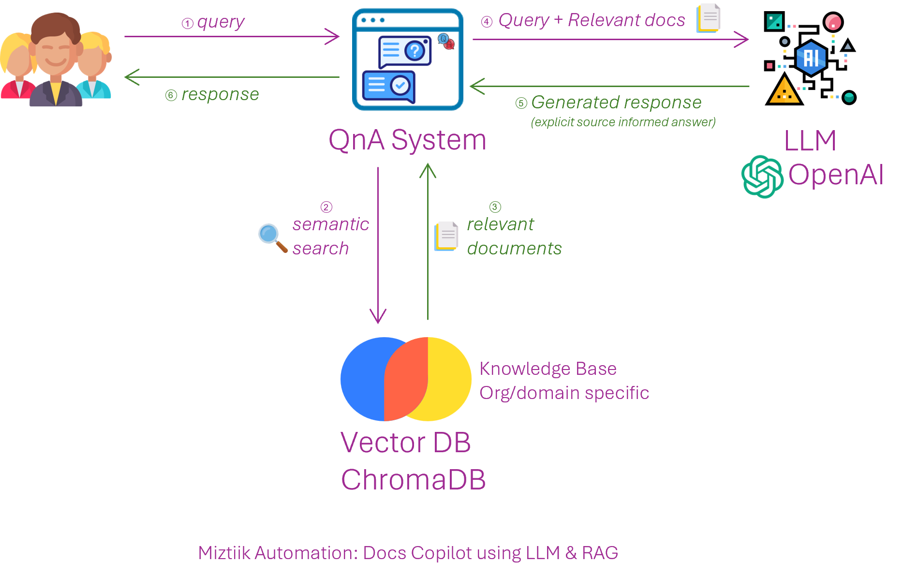

# Docs Copilot – A Generative AI App with RAG

Simple app to demonstrate how to use Large Language Models(LLM) to search through documentation. In this case, we are using Azure Docs Markdown files. This can be any text based files. We will be using Generative AI pattern of combining an LLM with external knowledge retrieval(commonly known as Retrieval-Augmented Generation-RAG) to build a simple question answering app.

Here’s how it works:

1. User querty is sent to the QnA App(_Python App_).
1. Query sent to Vector Database(_ChromaDB_) where a similarity search is performed.
1. Vector database returns relevant results to QnA App.
1. QnA App sends the user query and relevant results to the LLM(_OpenAI_).
1. LLM prepares a response based on the prompt querty and sends it back to the application.
1. User is shown the response.

## Pre-Requisites

- Python 3.x
- OpenAI API Key or Azure OpenAI API Key

## 🎯 Deploy & Test the solution
1. Clone the repo `git clone`
2. You can use any of the following tools to download some docs related to Azure functions. The raw data for the Azure Docs is available in the `data/azure_docs/` directory. Feel free add your own markdown files.
   1. [Download Github](https://download-directory.github.io/)
   2. [Downgit](https://minhaskamal.github.io/DownGit/)
   3. [GitZip](https://kinolien.github.io/gitzip/)
3. Update the `.env` file with your values
4. Run the Jupyter Notebook `src/docs_copilot_w_chroma.ipynb`

5. ## 🧹 CleanUp

   Destroy all the resources created. Execute the below command to delete the stack, or _you can delete the stack from console as well_

   - LLM Deployments
   - ChromaDB
  
### 💡 Help/Suggestions or 🐛 Bugs

Thank you for your interest in contributing to our project. Whether it is a bug report, new feature, correction, or additional documentation or solutions, we greatly value feedback and contributions from our community. [Start here](/issues)

### 👋 Buy me a coffee

 Buy me a [coffee ☕][900].

### 📚 References

1. [Azure OpenAI Docs - Getting Started][1]
2. [ChromaDB - Getting Started][2]
3. [LangChain - Vector Store][3]
4. [RAG - Keeping LLMs relevant and current][4]

[1]: https://learn.microsoft.com/en-us/azure/ai-services/openai/chatgpt-quickstart?tabs=command-line%2Cpython&pivots=programming-language-python
[2]: https://docs.trychroma.com/getting-started
[3]: https://python.langchain.com/docs/modules/data_connection/vectorstores/
[4]: https://stackoverflow.blog/2023/10/18/retrieval-augmented-generation-keeping-llms-relevant-and-current/

### 🏷️ Metadata

**Level**: 200

[100]: https://www.udemy.com/course/aws-cloud-security/?referralCode=B7F1B6C78B45ADAF77A9
[101]: https://www.udemy.com/course/aws-cloud-security-proactive-way/?referralCode=71DC542AD4481309A441
[102]: https://www.udemy.com/course/aws-cloud-development-kit-from-beginner-to-professional/?referralCode=E15D7FB64E417C547579
[103]: https://www.udemy.com/course/aws-cloudformation-basics?referralCode=93AD3B1530BC871093D6
[899]: https://www.udemy.com/user/n-kumar/
[900]: https://ko-fi.com/miztiik
[901]: https://ko-fi.com/Q5Q41QDGK